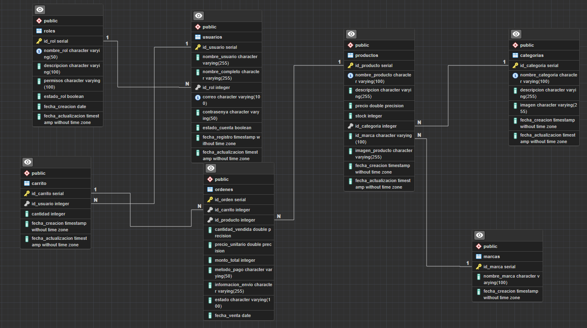

<h1 align = 'center'>Aroma de Café<h1>

<h2>Modelo de datos</h2>
Para abarcar una problemática es importante tener un modelo de datos ajustado a la necesidad del negocio a resolver. Además, es valioso para ordenar la información de manera eficiente y para garantizar la integralidad de los datos.

<h3>Tablas</h3>

Nuestro ecommerce cuenta con las tablas: usuarios,productos,categorias,marcas,carrito,ordenes y roles.

Relaciónes entre tablas:

Roles tiene una relación de 1 es a muchos con tabla usuarios, por medio del campo id_roles. Cada rol puede estar asociado a 1 o muchos usuarios y un usuario puede tener un rol. 

Usuarios tiene una relación de 1 es a muchos con la tabla carrito, esto podemos verlo en el campo id_usuarios. Un usuario puede tener de 1 varios carritos y un carrito estará asociado a un usuario. 

Carrito tiene una relación de 1 es muchos con la tabla ordenes, esta se demuestra con el campo id_carrito.

Productos tiene una relación de 1 es a muchos con la tabla ordenes por medio del campo id_productos. Una orden puede tener de 1 a muchos productos asociados y un producto puede estar en 1 o muchas ordenes

Categorias tiene una relación de 1 es a muchos con la tabla productos, esta se manifiesta por medio del campo id_categoria. Una categoria puede tener asociados 1 o más productos y un producto puede ter solo una categoria

Marcas tiene una relación de 1 es a muchos con productos, se manifiesta en el campo id_marca. Cada producto tiene una marca y una marca puede estar asociado a 1 o muchos productos

Una de nuestras tablas que ponemos denominar como critica es Ordenes. Esta tabla proporciona información sobre cuándo ocurrío la transacción, esto nos permitiría analizar las ventas y dar seguimiento de los pedidos.

--- SERVIDOR 

Este servidor backend proporciona una API RESTful para gestionar ciertos recursos.

Para poder utilizarlo es necesario unas configuraciones iniciales:

1- Es necesario crear una base de dato donde se va a almacenar toda la información del ecommerce, es necesario recordar el nombre de la base de datos ya que se va a utilizar en las configuraciones del servidor.

2- configurar las variables de entorno en el servidor:

Las variables a definir son las siguientes:

PORT //Puerto donde quieres que se ejecute el servidor.
HOST= //Dirección del servidor
USER= //usuario para la conexión a la base de datos
DATABASE //Nombre de la base de datos creado en el punto anteior 
PASSWORD //Contraseña de la base de datos
KEYTOKEN //llave para la encriptación de las contraseñas.

Rutas disponibles 

`GET /productos`

Descripción: Obtiene todos los productos.
Parámetros de consulta:  limit, page, order_by, por defecto están asignados los siguientes valores, 10, 1 y id_producto-ASC. Estos valores se deben enviar por la query.
Para el caso de limit  se aceptan solo valores númericos mayores a cero.
Para el caso de page se aceptan solo valores númericos mayores a cero.
Para el caso de order_by solo se aceptan los siguientes dos campos: el primero se aceptan ordenamiento debe contener id_producto, categoria o precio, para el segundo campo: ASC o DESC. Estos campos deben estar separados por el caracter "-". ejemplo: id_producto-ASC
Respuesta exitosa:
Código 200
Cuerpo de respuesta: Array de objetos.
Respuesta de error:
Código 400: Error por mala solicitud.
Código 500: Error interno del servidor.

`GET /productos/$id`

Descripción: Obtiene el producto enviado por la url $id.
Parámetros de consulta: Ninguno.
Respuesta exitosa:
Código 200
Cuerpo de respuesta: Array de producto.
Respuesta de error:
Código 400: Error id no valido.

`POST /login`

Descripción: Autenticación de usuario para obtener un token de acceso.
Parámetros de entrada:
{
email: Correo electrónico del usuario.
password: Contraseña del usuario.
}
Estos valores deben ser enviados por el body

Respuesta exitosa:
Código 201
Cuerpo de respuesta: Objeto con el token de acceso, nombre de usuario y correo electrónico.
json
Copy code

  "token": "eyJhbGciOiJIUzI1NiIsInR5cCI6IkpXVCJ9...",
  "nombre_usuario": "UsuarioEjemplo",
  "correo": "usuario@example.com"

Respuesta de error:
Código 404: Campos invalidos.
Código 401: Credenciales inválidas.
Código 500: Error interno del servidor.

`POST /registro`

Descripción: Registro de un nuevo usuario.
Parámetros de entrada, valores enviado por el body:
{
  name: Nombre del usuario.
  lastName: Apellido del usuario.
  email: Correo electrónico del usuario.
  password: Contraseña del usuario.
  passwordConfir: Confirmación de la contraseña del usuario.
}
Respuesta exitosa:
Código 201
Cuerpo de respuesta: Objeto con el mensaje de éxito.
json
Copy code
{
  "mensaje": "Usuario registrado correctamente"
}
Respuesta de error:
Código 400: Error de validación en los datos enviados.
Código 500: Error interno del servidor.

`GET /carrito`

Descripción: Obtiene todos los productos dentro del carrito
Parámetros de consulta: Se debe generar un id_carrito, el cual se genera automaticamente al agregar cualquier producto al carrito
Respuesta exitosa:
Código 200
Cuerpo de respuesta: Array de objetos.
Respuesta de error:
Código 400: Error por mala solicitud.
Código 500: Error interno del servidor.

`POST /carrito`

Descripción: Agrega un producto al carrito.
Parámetros de entrada:
id_producto: identificador del producto a agregar al carrito
cantidad: cantidad del producto a agregar
id_usuario: En caso de que el usuario este registrado, envío del id

Respuesta exitosa:
Código 201
Cuerpo de respuesta: Mensaje exitoso
json
{
  "mensaje": Producto agregado al carrito ${id_carrito}
}
Respuesta de error:
Código 400: Error de validación en los datos enviados.
Código 500: Error interno del servidor.

`PUT /carrito`

Descripción: Varia la cantidad de un producto en el carrito.
Parámetros de entrada:
id_carrito: Número aleatorio creado al agregar un producto en el carrito y que se almacena en los cookies.
id_producto: identificador del producto a agregar al carrito
cantidad: cantidad del producto a agregar

Respuesta exitosa:
Código 204
Cuerpo de respuesta: Mensaje exitoso
json
{
  "mensaje": "Cantidad del producto actualizado"
}
Respuesta de error:
Código 400: Error de validación en los datos enviados.
Código 500: Error interno del servidor.

`DELETE /carrito`

Descripción: Elimina uno o todos los productos del carrito.
Parámetros de entrada:
id_carrito: Número aleatorio creado al agregar un producto en el carrito y que se almacena en los cookies.
id_producto: identificador del producto a agregar al carrito
BorraTodo: Valor booleano true o false, para eliminar todos los productos del carrito

Respuesta exitosa:
Código 204
Cuerpo de respuesta: Mensaje exitoso
json
{
  "mensaje": "Producto eliminado del carrito"
}
Respuesta de error:
Código 400: Error de validación en los datos enviados.
Código 500: Error interno del servidor.

`GET /perfil`

Descripción: Obtiene los datos del perfil de usuario
Parámetros de consulta: token generado al iniciar sesión, se debe enviar por la cabecera Authorización
Respuesta exitosa:
Código 200
Cuerpo de respuesta: Array de objetos.
Respuesta de error:
Código 401: Error por mala solicitud token invalido.
Código 500: Error interno del servidor.

`PUT /perfil`

Descripción: Modifica los datos del usuario
Parámetros de consulta: token generado al iniciar sesión, se debe enviar por la cabecera Authorización.
Parametros a modificar:
nombre: nombre completo del usuario;
contraseña: contraseña actual;
nueva_contraseña: nueva contraseña que cumpla con los niveles de seguridad
Respuesta exitosa:
Código 200
Cuerpo de respuesta: Array de objetos.
Respuesta de error:
Código 401: Error por mala solicitud token invalido.
Código 500: Error interno del servidor.